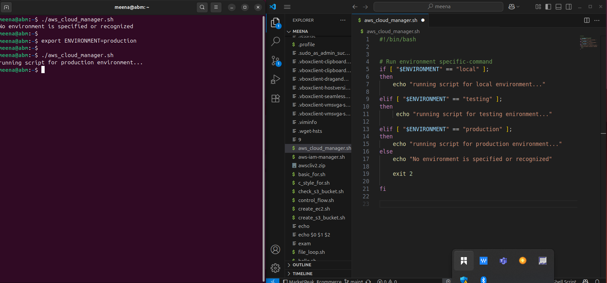
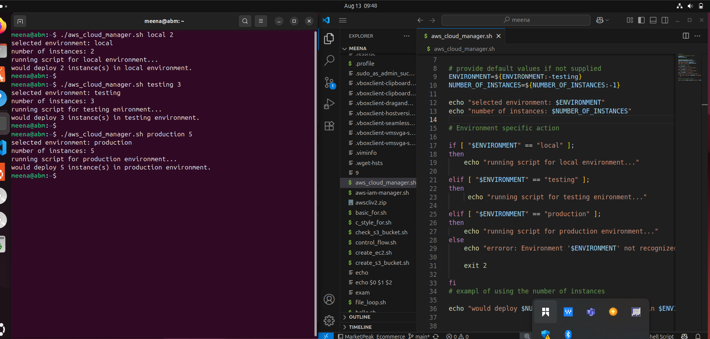

# Understanding_Environment_Variables_And_Infrastracture_Environment 

In this mini project, I learned how to effectively manage infrastructure environments and environment variables in shell scripting to create flexible, reusable scripts for different stages of software deployment. I practiced distinguishing between local, testing, and production environments and saw how environment variables can dynamically configure scripts for database connections or cloud infrastructure. I implemented positional parameters to pass arguments at runtime, allowing scripts to adapt without hard-coding values, and learned how to provide default values for robustness. Additionally, I incorporated argument validation to ensure the script receives the correct number of inputs, and structured conditional logic to perform environment-specific actions. Overall, this project reinforced best practices in shell scripting, making scripts safe, maintainable, and adaptable to multiple environments.
.

.

.

.
